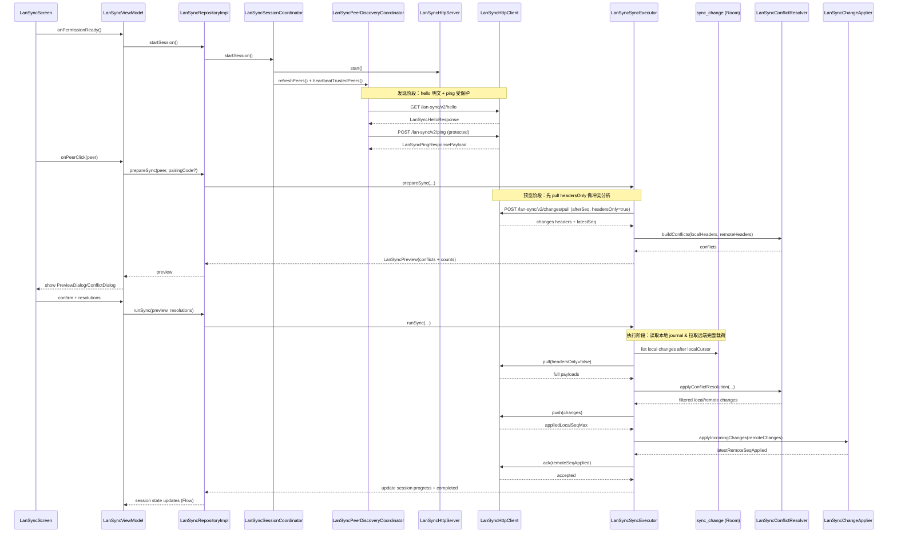

# 局域网同步（LAN Sync V2）协议概览与架构图

> 适用范围：`app/src/main/java/com/kariscode/yike/data/sync/*`
>
> 本文目的：把“发现 → 配对 → 预览 → 冲突决议 → 双向增量同步 → 落库应用 → cursor 推进”的主链路解释清楚，
> 并提供一张可维护的架构图，避免协议继续演进时只靠读代码在脑内拼装。

---

## 1. 设计目标与约束

LAN Sync V2 的核心目标是：在同一 Wi‑Fi 局域网内，让两台设备在**用户明确进入同步页**的时间窗口内完成一次可预览、可决议、可回滚边界清晰的同步。

约束（保持长期稳定）：

- **只在同步页打开期间**启动 NSD 发现、HTTP 服务与心跳；页面退出后应回到完全离线状态。
- **先预览再执行**：执行前必须先生成双向变更规模与冲突列表，让用户做出显式决议。
- **增量同步**基于本地 `sync_change` journal 与双 cursor 推进；避免每次覆盖式全量传输。
- **冲突以“同实体最新可变变更”为准**：减少中间态噪音，避免把“同一批次内的覆盖更新”误判成冲突。
- **落库与副作用编排集中**：远端变更落库、设置合并、提醒重建都收口在应用器中，避免散落在网络或 UI 层。

---

## 2. 模块与职责边界（组件图）

在仓储层保持单一入口（`LanSyncRepository`）的前提下，协议实现拆成协作者：

- `LanSyncRepositoryImpl`：对外门面；转发 start/stop/prepare/run/cancel。
- `LanSyncSessionCoordinator`：会话生命周期（启动/停止 HTTP 服务与 NSD、初始化本机档案、触发 peer 刷新）。
- `LanSyncPeerDiscoveryCoordinator`：设备发现与心跳；将 NSD 发现结果转成可用 peer 列表并刷新可信状态。
- `LanSyncSyncExecutor`：协议执行核心；负责 hello、配对、预览编排、真正同步、ack 推进。
- `LanSyncHttpServer` / `LanSyncHttpClient`：Ktor 的传输层封装；只暴露协议端点，不承载业务判断。
- `sync_change`（Room 表）+ `LanSyncChangeRecorder`：本地变更 journal，作为增量同步事实来源。
- `LanSyncConflictResolver`：冲突检测 + 变更压缩（同实体只保留最新）。
- `LanSyncChangeApplier`：远端变更落库、设置合并、提醒重建与必要的索引刷新。

---

## 3. 主链路时序图（架构图）

---

## 4. 冲突判定与压缩规则

冲突检测的稳定规则（`LanSyncConflictResolver`）：

- 以 `entityType + entityId` 为 key。
- 对可变实体（Deck/Card/Question/Settings）只保留窗口内最新一条变更。
- `REVIEW_RECORD` 作为追加型历史事件，完整保留，不参与“最新覆盖”压缩。
- 双端都 `DELETE` 或 payloadHash 与 operation 完全一致时，不构成冲突。

这样设计的原因是：

- 用户只需要对“真正有分歧的最终状态”做决策，而不是被中间态噪音淹没。
- 预览阶段可用 headersOnly 大幅降低传输与解密成本。

---

## 5. 落库与副作用编排

远端变更应用（`LanSyncChangeApplier.applyIncomingChanges`）的核心原则：

- 先按外键顺序 upsert：Deck → Card → Question → ReviewRecord。
- 再执行 delete（按实体类型分组）。
- Settings 在事务外合并并落盘，然后触发提醒重建（避免把“业务设置一致性”留到下一次进入设置页才刷新）。

---

## 6. 相关代码入口（便于追踪）

- 协议门面：`app/src/main/java/com/kariscode/yike/data/sync/LanSyncRepositoryImpl.kt`
- HTTP 端点：`app/src/main/java/com/kariscode/yike/data/sync/LanSyncHttpServer.kt`
- HTTP 客户端：`app/src/main/java/com/kariscode/yike/data/sync/LanSyncHttpClient.kt`
- 冲突解析：`app/src/main/java/com/kariscode/yike/data/sync/LanSyncConflictResolver.kt`
- 远端应用：`app/src/main/java/com/kariscode/yike/data/sync/LanSyncChangeApplier.kt`

